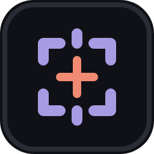
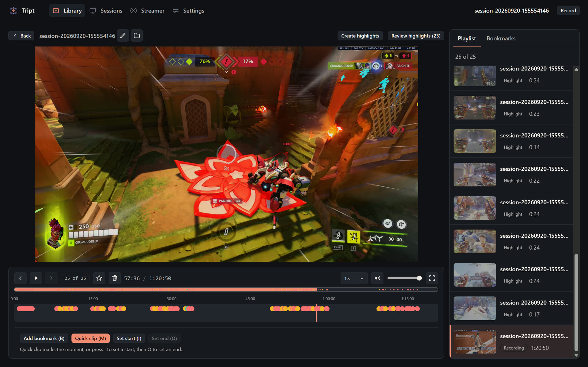

# Tript



**Tript watches your screen while you play, and records moments you might want to share.**



New here? The [documentation](https://github.com/LeSqueed/Tript/wiki) covers getting started, reviewing highlights, and every keyboard shortcut.

## What it does

Tript sits quietly in the background and watches for a supported game. The moment it recognizes
one, it starts recording automatically if you so desire. While you play, it keeps an eye out for the moments that matter and drops a bookmark for supported games (or a fullclip) the instant one happens, so your highlights are already marked by the time you're done playing.

All of that detection runs **entirely on your own machine**, from small bundled ML models, nothing
about your screen or your gameplay is ever uploaded anywhere without your permission.

Recording itself is handled by [OBS](https://obsproject.com/)'s engine under the hood, so capture quality and performance are the same you'd get from OBS directly.

## Support development

[](https://ko-fi.com/lesqueed)

Tript started as something I built for my own use, out of frustration with other tools and the games they didn't support. Making it available like this means running a server to host detection models (so updates work, and games nobody plays don't take up space for everyone else) and to resolve automatically detected games.

With enough support, there's room to get a dedicated server for this and grow it from there. Some ideas I'd like to explore: easier ways to share gameplay, (temporarily) hosted on our own platform, and even community-trained models: opening up training to the community for new games, with people publishing their own models.

These are just ideas right now, nothing is set in stone. For things like permanent clip hosting I might eventually need membership tiers, but that's a decision for later. What I can promise: key features and quality will never be locked behind a paywall. If membership ever happens, it'll be for things where payment reflects real running costs, with maybe small extras on top. It won't be for things like high-quality recordings, automatic highlight creation, or access to finished models, which should stay free for everyone.


## Features

- **Automatic detection & recording:** Tript starts and stops recording on its own as you launch
  and quit a supported game.
- **Local-only detection:** everything runs on-device; nothing about your screen or gameplay
  leaves your machine.
- **Automatic bookmarks and clips:** highlight moments are marked (or clipped) as they happen,
  with no manual input required.
- **Manual hotkeys:** global shortcuts to toggle recording, drop a bookmark, or grab a quick clip
  whenever you want one yourself.
- **Native notifications:** a toast and a sound cue when recording starts, stops, or something
  goes wrong.
- **Streaming with OBS:** OBS and Tript record games the same way, and if both do it at once one of
  them may only see a black screen. Turn on sharing in the Streamer tab and Tript sends the game
  picture to OBS instead, with a delay of about 17 ms at 60 FPS. In OBS, install the
  [Spout2 Plugin for OBS](https://github.com/Off-World-Live/obs-spout2-plugin), add a *Spout2
  Capture* source, pick `Tript`, and use it instead of Game Capture for games Tript records. Tript
  still works without OBS, and sharing starts on its own when OBS opens.
- **Don't see your game?** You can request support for a game right from Tript's settings. Note that this sends some information about your install and machine, such as an install ID and your IP. This information is used to prevent people spamming the server and is not intended to identify an individual user. 

## Supported games

Tript is in early **alpha**, and right now that means one supported game: **Overwatch** (events should create bookmarks regardless of language, but for the best experience I'd suggest English. Other languages are planned to be added with hopefully community help and feedback). The goal is to make it relatively easy to add more games in the future, perhaps even allowing community models to be created.

## Status

Tript is **alpha software**. Expect rough edges. Windows is the primary supported platform today.
The downloadable build is self-contained and bundles everything it needs, including OBS itself, so
there's nothing separate to install. Linux is untested, it might work, it might not. 

## Things that need testing (uncomfirmed or likely to cause issues)

Found one of these, or something else? Join the Discord and let me know.

[](https://discord.gg/G4DR3Meumn)

- **Wide screen event detection** currently the model is trained and regions are based on a 16:9 aspect ratio. Other aspect ratio's are untested. I'd love to receive feedback with a ideally a high quality recording.
- **Non English game clients** to give the best experience, Tript tries to avoid creating events when you are dead and spectating the person who eliminated you or when you are spectating a teammate. To ensure we only show your best moments. This is done based on text on your screen. Leading to it creating bookmarks or highlights of moments that are not of interest to you.
- **Nvidia and Intel GPUs** I only had access to an AMD GPU during testing. Nvidia or Intel will hopefully work out of the box. Report issues if you do encounter them.
- **Sharing with OBS** works here with one GPU and one OBS install. Multi-GPU machines, other Spout
  receivers and HDR games are untested, so report anything that looks off.
- **Automated game detection outside of Steam** - Tript tries to automatically detect when you are playing a game and add it to the games library. The only tested launcher is currently Steam. If you find it is not properly detecting games, please report on this. Including your install location and what launcher you use to play the game.

## Getting started

1. Download the latest release from the
   [Releases page](https://github.com/LeSqueed/Tript/releases/latest).
2. Unzip it anywhere.
3. Run `Tript.exe`.

**Requirements:** Windows 10 or later.

## License

Tript is licensed under the GNU General Public License v2.0 or later (GPL-2.0-or-later).

The Windows download also includes, as separate programs under their own licenses: the OBS Studio
runtime (GPL-2.0-or-later) and an FFmpeg build from [BtbN/FFmpeg-Builds](https://github.com/BtbN/FFmpeg-Builds)
(GPL-3.0, license in `App/vendor/ffmpeg/LICENSE.txt`). The exact FFmpeg release is pinned in the
`Makefile` (`FFMPEG_TAG`, `FFMPEG_BUILD`); its source is the FFmpeg commit named in the build.

---

## Building from source

Tript is also fully buildable from source, on both Windows and Linux.

**Toolchain:** .NET 10 SDK, Node.js 20.19+ (22 LTS recommended), and Git LFS (the detection models
are stored through LFS, run `git lfs pull` after cloning, or the models will just be small pointer
files and detection won't work).

**Linux system packages:** `libwebkit2gtk-4.1-0` and `gstreamer1.0-plugins-good` (both needed for
the desktop shell window), and `obs-studio` 30.1+ with `obs-ffmpeg-mux` for real recording (OBS is
discovered at runtime on Linux; Windows bundles its own copy instead). A display server (X11, or
Wayland with XWayland) is required for real recording.

```sh
make web      # build the React frontend only
make shell    # frontend + publish the desktop shell into dist/<config>
make windows  # Windows self-contained publish with the bundled OBS runtime (cross-compiles from Linux)
make test     # .NET test suite + frontend Vitest suite
make run      # run the assembled build (prefers the desktop shell, falls back to the headless host)
```

This covers the essentials for building and running Tript yourself. The deeper internals
(resolver configuration, the per-launch security key, model training, and the full project layout)
aren't documented here; the source itself (particularly the `Makefile` and the code under
`src/Tript.App`) is thoroughly commented and is the authoritative reference for that detail.
